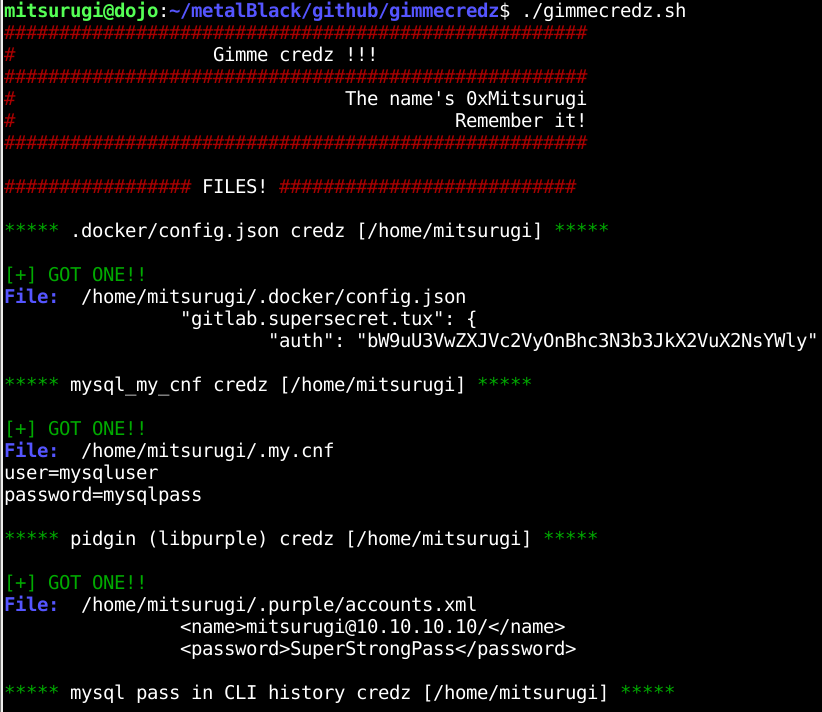

You are a pentester, and you totally pwn that linux box (desktop, laptop, server, whatever). Now, what? You can read a lot of files, config files, history and so on in order to find something smelly. That could be time consuming, boring, or long. I decided to write a tool to automatize credentials picking on a pwned box.

# Objective
This tool can help pentesters to quickly dump all credz from known location, such as .bash_history, config files, wordpress credentials, and so on...
This is not a hacking tool, just a collection of well-known files with password in them.
The password can be in clear, base64 or enciphered form. It's up to the pentester to use them, decode them or change them.
This tool can be launch by root or any users, it will autodetect file access and adapt accordingly.

# Goals
 - this tool is in bash because bash is everywhere, and I wanted it to be the most compatible with all pwned systems without having to install any third party lib/shell/script language.
 - this tool should be easy to read/tweak and easy to add new password dumps
 - this tool should not be taken too seriously
 - this tool uses mainly bash with a little bit of grep (egrep), find and some other usual tools.
 - I don't care if this tool fails softly on one or another files. I prefer a simple tool with little fails than an heavier tool bloated with failchecks and sanity verification.
 - this tool should work quick, for this reason I don't want some hasardous find, such as: `find / -type f -exec grep password {} \;` find is limited with maxdepth 3 at most
 - this tool should be autodocumented. Read it.
 - this tool is not sponsored by the NSA and won't send your credz to any thirdparty.

# Usage
Easy usage:
```bash
wget https://raw.githubusercontent.com/0xmitsurugi/gimmecredz/master/gimmecredz.sh
chmod +x gimmecredz.sh
./gimmecredz.sh
```
Or, for the l33t:
```bash
$ curl https://raw.githubusercontent.com/0xmitsurugi/gimmecredz/master/gimmecredz.sh | bash
```
Check the start of the script. You can set vars. Currently, you can force to check root-owned files even if you are user (in hope of misconfiguration of the targets). You can also put script in verbose where it show everything, even failures.

# Future devs
 - adding more files, moar, moar!! The moar, the better!
 - adding the ability to save any found file. You launch script, you get a tarball with all of the juicy files in it. (see the TAR variable)

# Screenshots (everybody loves screenshots!)


# Key extraction:
Except for "root access", all files are check. If it's related to /home and if you're root, it will loop for all users.

## Root access
 - shadow file if we have a bash shell
 - WPA password store in wpa_supplicant or NetworkManager
 - grub password
 - ldap password
 - All other checks are done for root, and for 

## Files with credz
 - .docker/config.json
 - mysql mycnf
 - pidgin (libpurple)
 - postgresql
 - mysql and rdesktop pass stored in .bash_history
 - ssh keys (protected by pass, and unprotected)
 - keepassx databases (ability to tell if it's currently open)

## Browsers
 - Firefox logins.json and key3.db
 - Chrome Login data

## Webapps
 - wordpress credz
 - drupal credz

## More to come:
I want to add databases, tomcat passwords, better .bash_history parsing, and any other file of interest which contains passwords and which can be accessed reliably. If you have any idea/improvement, share it.

# FAQ
##### You forgot to check this file or this directory
Make a pull request, send me an email, ping me on twitter, I'll add it

##### Can you change something here or here in the script?
Make a pull request, send me an email, ping me on twitter, I'll add it

##### Your tool fails to extract a password
Make a pull request, send me an email, ping me on twitter, I'll add it (the more files, the better)

##### I've found a bug!
Make a pull request, send me an email, ping me on twitter, I'll add it

##### I love you and I want to marry you
Make a pull request, send me an^W^W^W Wait, WHAT?

##### Does it have a license?
BeerWare. If you're happy to use it, ping me :)

##### There is no configure or make?
Dude, this is pure bash

##### Is it compatible with blockchain?
LMAO!! Nope.

##### No really?
This is in my roadmap, I'll code it in v42.193.254-patchlevelGoldEdition-EditorFinalCut. Reservation needed, ICO in 3 months, It'll cost only 25k$ for you.

##### But this look like Lazagne which is a tool designed to extract password?
Yes. and [Lazagne](https://github.com/AlessandroZ/LaZagne) is a really great tool. Use it with my blessings. And [pupy] (https://github.com/n1nj4sec/pupy/) too. I'm a happy user of both :)

##### Does P=NP?
I have a beautiful demonstration of this theorem, but it doesn't fit on ~~this margin~~. ~~this github~~. this internet. 

##### This is not secure code
We are speaking of pwned system, so what? This is designed for pentesters, and they should know what they do.

##### I've tested it and now, everybody have seen my password on the screen!
Is your password hunter2?

# Thanks
thanks for @HexpressoCTF for inspirational IRC talk :)
